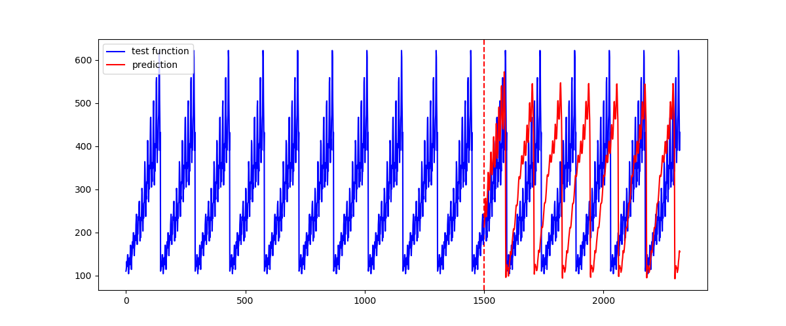

# LSTM Time Series Prediction
LSTM using Keras to predict the time series data. There are two running files to predict international airline passengers. We use 65% of data to train the LSTM model and predict the other 35% of data and compare the predicted data with real data.

International airline passengers: Number of passengers for each month in thousands

## Requirements
Please check the version of libraries I used for this LSTM.

- pandas==0.23.3
- numpy==1.15.4
- tensorflow==1.12.0
- keras==2.2.4
- matplotlib==3.0.2

## Reference
- international-airline-passengers.csv: https://www.kaggle.com/andreazzini/international-airline-passengers

Output for passengers_lstm.py.

Train Score: 0.0016482554761827904
Test Score: 0.0017052177690008714
