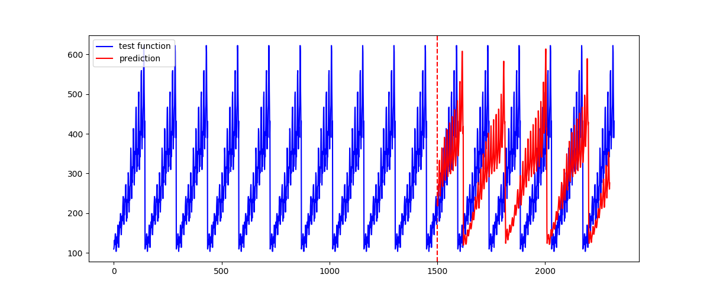
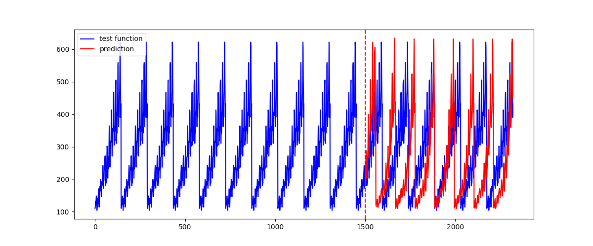

# LSTM Time Series Prediction
LSTM using Keras to predict the time series data. There are two running files to predict international airline passengers. passengers_lstm.py is predicting without using stateful and lstm_stateful.py is using stateful and check if stateful helps the prediction for the time series data.

We use 65% of data to train the LSTM model and predict the other 35% of data and compare the predicted data with real data.

## Requirements
Please check the version of libraries I used for this LSTM.

- pandas==0.23.3
- numpy==1.15.4
- tensorflow==1.12.0
- keras==2.2.4
- matplotlib==3.0.2

Output for passengers_lstm.py.

Output for lstm_stateful.py.

